<div align="center">

# 🍫 رایکا | فروشگاه شکلات ایرانی

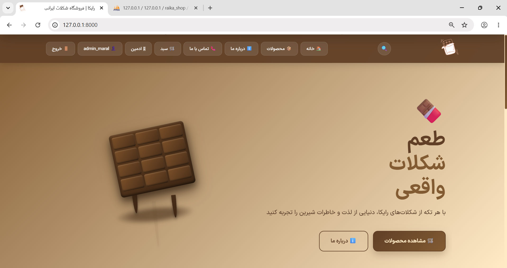

<br>

**فروشگاه اینترنتی کامل شکلات با Laravel 11**

[](https://laravel.com)
[](https://php.net)
[](https://mysql.com)
[](https://developer.mozilla.org)
[](LICENSE)

<br>

[معرفی](#-درباره-پروژه) • [امکانات](#-امکانات) • [نصب](#-نصب-و-راه‌اندازی) • [اسکرین‌شات](#-اسکرین‌شات‌ها) • [تماس](#-توسعه‌دهنده)

</div>

---

## 📖 درباره پروژه

**رایکا** یک فروشگاه اینترنتی کامل و حرفه‌ای برای فروش شکلات است که با **Laravel 11** و **MySQL** توسعه داده شده.

این پروژه به‌عنوان یک **نمونه کار فول‌استک** طراحی شده و تمام جنبه‌های یک فروشگاه واقعی را پوشش می‌دهد. در ساخت این پروژه، از **ابزارهای هوش مصنوعی** به‌عنوان دستیار استفاده شده — رویکردی که امروز در صنعت نرم‌افزار کاملاً استاندارد است.


## 💡 درباره توسعه

این پروژه با **ترکیب دانش فنی و ابزارهای AI** توسعه یافته. 

**نقش من در پروژه:**
- 🎯 **طراحی و معماری** کل ساختار پروژه
- 🛠️ **پیاده‌سازی منطق کسب‌وکار** (سبد خرید، سفارشات، نظرات)
- 🎨 **طراحی UI/UX** و استایل‌دهی
- 🔍 **دیباگ و بهینه‌سازی** کد
- 📊 **طراحی دیتابیس** و روابط
- 📝 **نوشتن مستندات** و تست

**نقش AI (به‌عنوان دستیار):**
- ⚡ سرعت‌بخشیدن به کدنویسی (Boilerplate)
- 💡 پیشنهاد راه‌حل‌های بهتر
- 🔧 کمک در Debugging
- 📚 آموزش مفاهیم جدید


## 🎓 چیزهایی که تو این پروژه یاد گرفتم

این پروژه برای من یک **مسیر یادگیری کامل** بود. مهارت‌هایی که کسب کردم:

### Backend (Laravel)
- ✅ **MVC Architecture** و کار با Route, Controller, Model, View
- ✅ **Eloquent ORM** و روابط پیچیده (HasMany, BelongsTo)
- ✅ **Database Migrations** و طراحی Schema
- ✅ **Authentication** از صفر (بدون پکیج خارجی)
- ✅ **Middleware** و محافظت از صفحات
- ✅ **Session Management** و مدیریت سبد خرید
- ✅ **Validation** و Error Handling
- ✅ **File Upload** و مدیریت تصاویر
- ✅ **Soft Delete** و Restore
- ✅ **Eager Loading** و بهینه‌سازی Query

### Frontend
- ✅ **CSS خالص** بدون Framework (طراحی از صفر)
- ✅ **JavaScript (Vanilla)** برای AJAX
- ✅ **Responsive Design** کامل (Mobile First)
- ✅ **CSS Animations** و Transitions
- ✅ **RTL Design** برای زبان فارسی

### SEO & Performance
- ✅ **Meta Tags** و Open Graph
- ✅ **Sitemap.xml** داینامیک
- ✅ **Robots.txt** بهینه
- ✅ **Canonical URL** و جلوگیری از Duplicate Content

### DevOps & Tools
- ✅ **Git & GitHub** (مدیریت نسخه)
- ✅ **Composer** (مدیریت پکیج)
- ✅ **phpMyAdmin** (مدیریت دیتابیس)
- ✅ **XAMPP** (محیط توسعه)
- ✅ **VS Code** و تنظیمات حرفه‌ای

### Soft Skills
- 🧠 **حل مسئله** و دیباگ سیستماتیک
- 📖 **خواندن مستندات** فنی به انگلیسی
- 🔍 **جستجو و یادگیری مستقل**
- 🤖 **استفاده هوشمند از AI** به‌عنوان ابزار کار
- ⏱️ **مدیریت زمان** و پروژه‌محور


## ✨ امکانات

<table>
<tr>
<td width="50%" valign="top">

### 🛍️ بخش کاربر

- 🏠 **صفحه اصلی** با Hero Section و انیمیشن
- 📦 **لیست محصولات** با گرید ریسپانسیو
- 🔍 **جستجوی زنده** (AJAX)
- 🎚️ **فیلتر پیشرفته**: دسته، قیمت، موجودی، ویژه
- 📊 **مرتب‌سازی**: جدید، ارزان، گران، محبوب
- 📱 **سایدبار Dropdown** در موبایل
- 🍫 **صفحه محصول** با اسلایدر عکس
- 📏 **انتخاب Variant** (وزن / تعداد)
- ⭐ **نظرات و امتیاز** (۵ ستاره)
- 🛒 **سبد خرید** با Session
- 💳 **Checkout** و ثبت سفارش
- 👤 **پروفایل** + تاریخچه سفارشات
- 📍 **Breadcrumb** و **Toast Notification**
- 📱 **کاملاً ریسپانسیو** + منوی همبرگری

</td>
<td width="50%" valign="top">

### 🎛️ پنل مدیریت

- 📊 **داشبورد آماری** با نمودار فروش ۷ روزه
- 📦 **CRUD کامل محصولات**
- 🖼️ **آپلود چند عکس** + گالری
- 📏 **مدیریت Variant** محصولات
- 🛒 **مدیریت سفارشات** با فیلتر
- 🔄 **تغییر وضعیت سفارش** (۵ حالت)
- 📂 **مدیریت دسته‌بندی** (Soft Delete + Reassign)
- 💬 **مدیریت نظرات** (تأیید / رد / حذف)
- 🔍 **جستجوی زنده** محصولات و سفارشات
- 📈 **آمار درآمد** و سفارشات در انتظار
- 🎨 **رابط کاربری مدرن** و ریسپانسیو
- 🔐 **احراز هویت** با Middleware ادمین

</td>
</tr>
</table>

### 🎨 طراحی و UX

- ✨ **فونت ایران‌سنس** برای خوانایی بهتر
- 🍫 **پالت رنگی گرم** (قهوه‌ای، کرم، طلایی)
- 🎬 **انیمیشن‌های نرم** (Fade, Slide, Hover)
- 🌰 **انیمیشن ذرات کاکائو** روی دسته‌بندی‌ها
- 🔔 **Toast Notifications** شناور از راست
- ⬆️ **دکمه Back to Top** هوشمند
- 📄 **صفحات خطای سفارشی** (۴۰۳، ۴۰۴، ۵۰۰)
- ⚡ **Skeleton Loading** و Micro-interactions
- کاملا ریسپانسیو
---

## 🛠️ تکنولوژی‌های استفاده‌شده

<div align="center">

| Backend | Frontend | Tools & DevOps |
|:-------:|:--------:|:--------------:|
| Laravel 11 | HTML5 + CSS3 | Git + GitHub |
| PHP 8.2+ | JavaScript (Vanilla) | Composer |
| MySQL 8.0 | Blade Template | XAMPP / Apache |
| Eloquent ORM | Font: IRANSans | VS Code |
| Session Storage | CSS Animations | phpMyAdmin |
| Middleware | AJAX / Fetch API | Postman |

</div>

---

## 📸 اسکرین‌شات‌ها

### 🏠 صفحه اصلی


### 📦 لیست محصولات

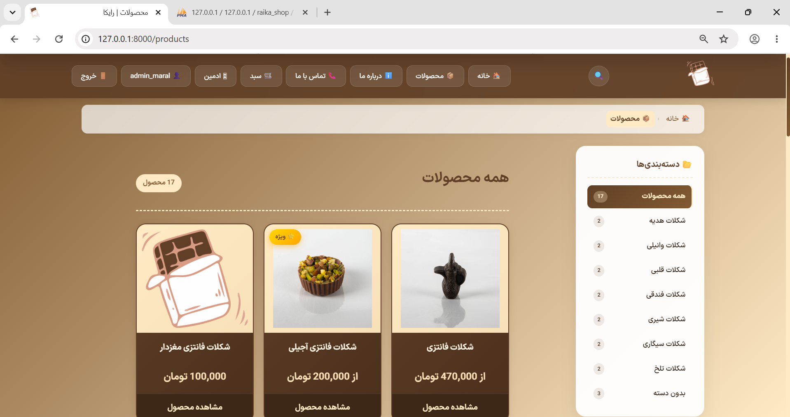

### 🍫 جزئیات محصول + اسلایدر


### 🛒 سبد خرید

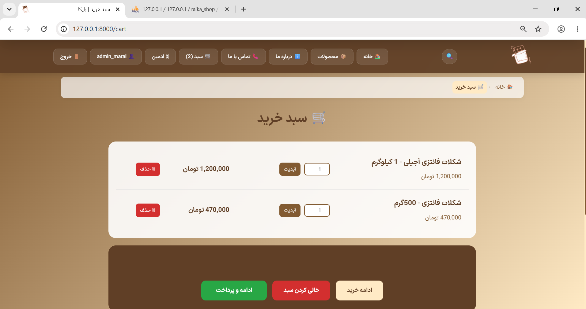

### 💳 تکمیل خرید

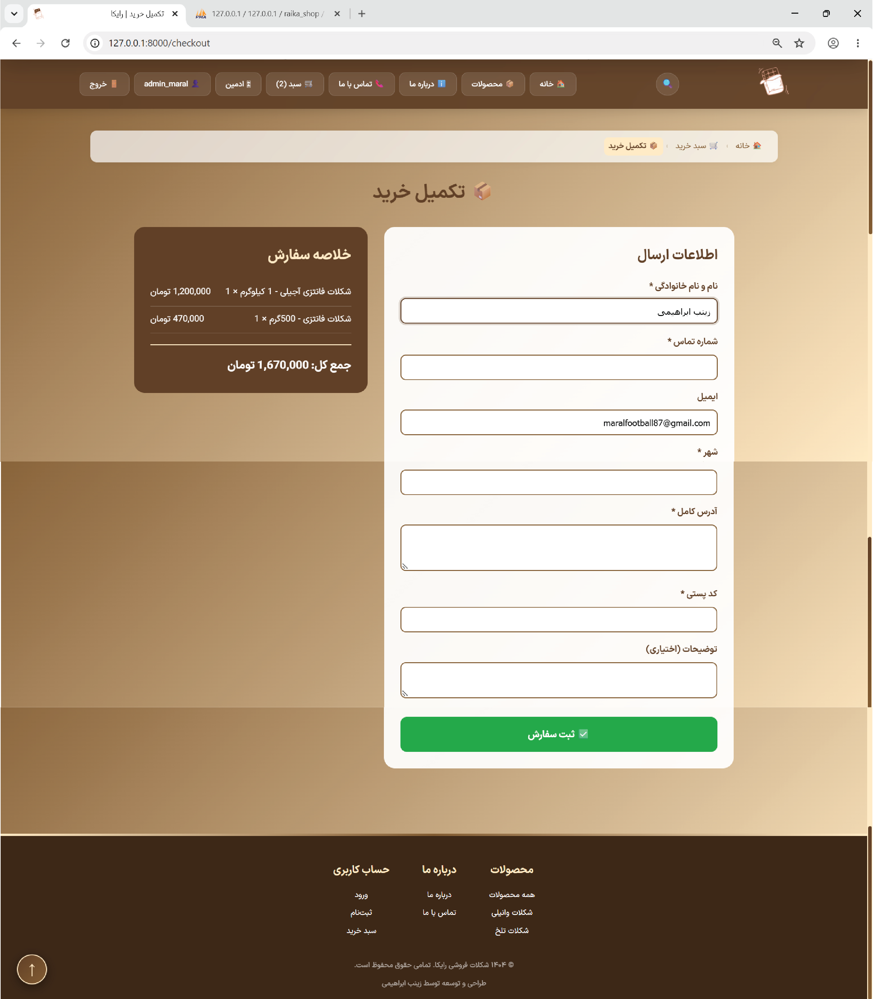

### 🔐 ورود و ثبت‌نام

<table>
<tr>
<td width="50%">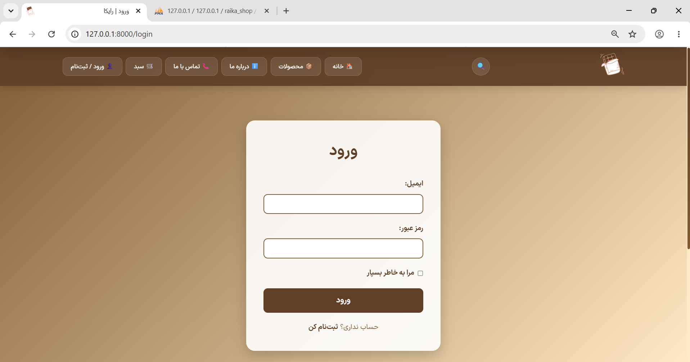</td>
<td width="50%">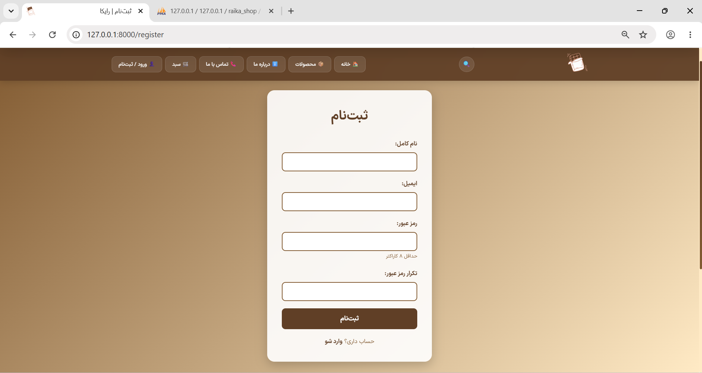</td>
</tr>
</table>

### 👤 پروفایل کاربر

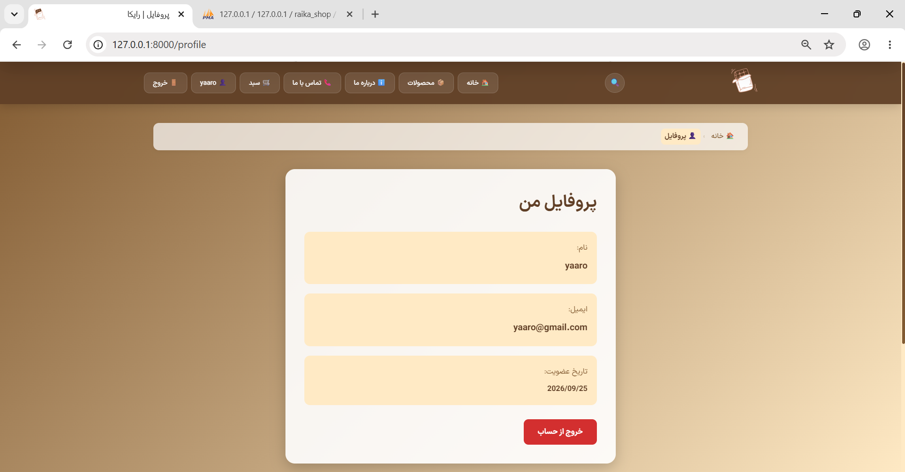

### 🎛️ داشبورد مدیریت

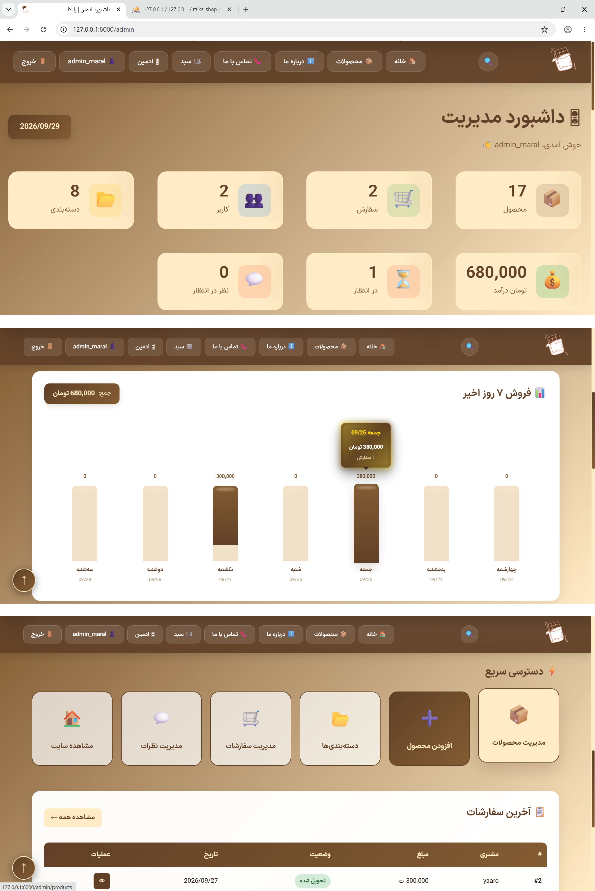

### 📦 مدیریت محصولات

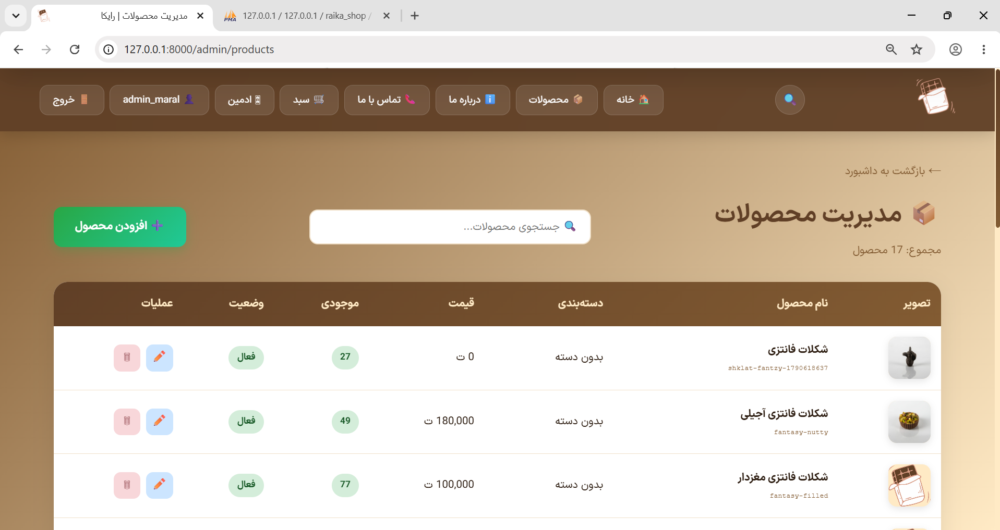

### 🛍️ مدیریت سفارشات

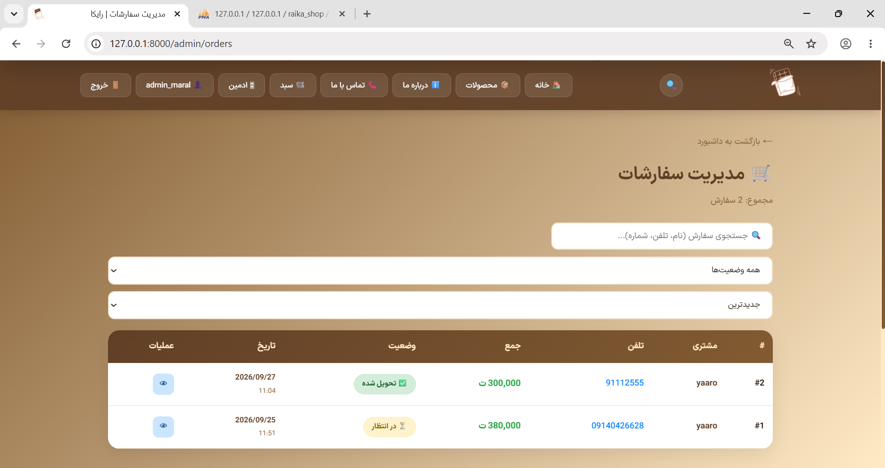

### 💬 مدیریت نظرات

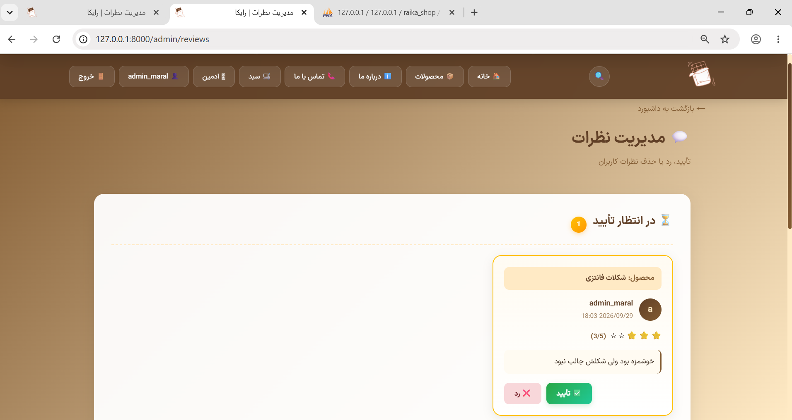

### 📱 نسخه موبایل

<table>
<tr>
<td width="50%">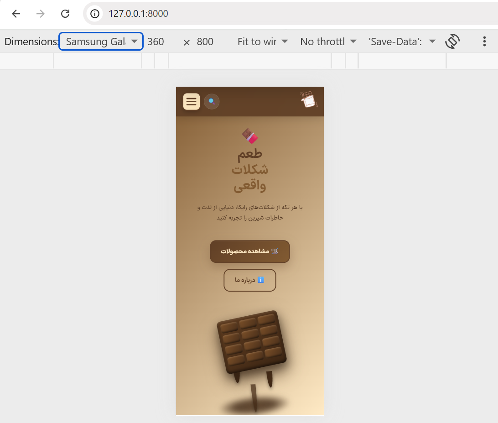</td>
<td width="50%">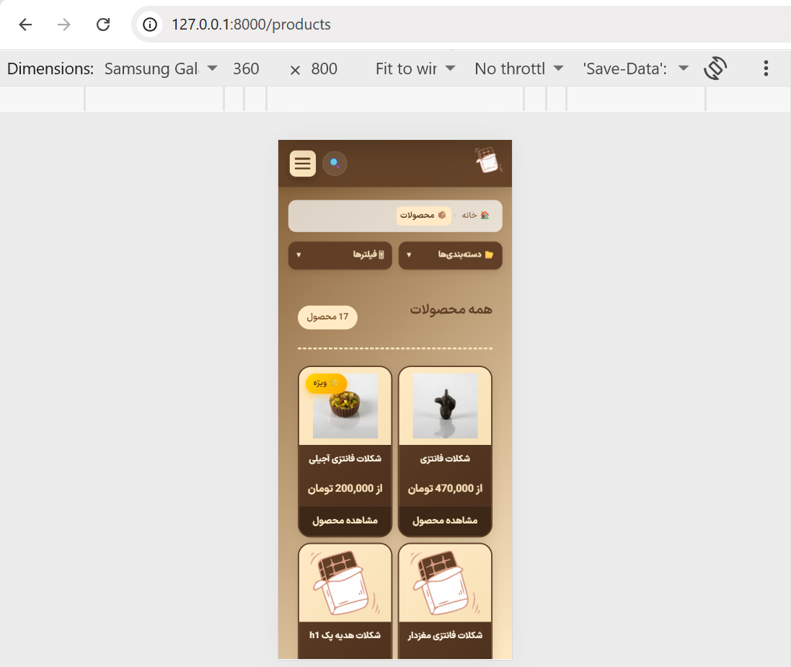</td>
</tr>
</table>

---

## 🚀 نصب و راه‌اندازی

### 📋 پیش‌نیازها

قبل از شروع، مطمئن شو اینا نصب داری:

- **PHP** >= 8.2
- **Composer** ([getcomposer.org](https://getcomposer.org))
- **MySQL** >= 8.0 (یا MariaDB)
- **Git** ([git-scm.com](https://git-scm.com))

### 📥 مراحل نصب

```bash
# 1. Clone کردن پروژه
git clone https://github.com/YOUR-USERNAME/raika-shop.git
cd raika-shop

# 2. نصب پکیج‌های PHP
composer install

# 3. کپی فایل تنظیمات محیطی
cp .env.example .env

# 4. ساخت کلید اپلیکیشن
php artisan key:generate

# 5. تنظیم دیتابیس
# فایل .env رو باز کن و این مقادیر رو تنظیم کن:
# DB_DATABASE=raika_shop
# DB_USERNAME=root
# DB_PASSWORD=
```

### 🗄️ ساخت دیتابیس

تو **phpMyAdmin** یک دیتابیس به اسم `raika_shop` بساز.

### 🗃️ اجرای Migration و Seeder

```bash
# 6. ساخت جداول + داده‌های اولیه
php artisan migrate --seed

# 7. ساخت لینک استوریج (برای عکس‌ها)
php artisan storage:link

# 8. اجرای سرور
php artisan serve
```

### ✅ تمام!

برو آدرس: **http://127.0.0.1:8000**

---

## 🔑 اطلاعات ورود پیش‌فرض

بعد از اجرای `migrate --seed`، دو کاربر ساخته می‌شن:

<table>
<tr>
<th>نقش</th>
<th>ایمیل</th>
<th>رمز عبور</th>
</tr>
<tr>
<td>🎛️ <strong>ادمین</strong></td>
<td><code>admin@raika.com</code></td>
<td><code>password</code></td>
</tr>
<tr>
<td>👤 <strong>کاربر عادی</strong></td>
<td><code>user@raika.com</code></td>
<td><code>password</code></td>
</tr>
</table>

> ⚠️ **هشدار امنیتی:** در محیط production حتماً رمزها را تغییر دهید!

---

## 📂 ساختار پروژه

```
raika-shop/
│
├── 📁 app/
│   ├── Http/
│   │   ├── Controllers/
│   │   │   ├── Admin/                    # کنترلرهای ادمین
│   │   │   │   ├── CategoryController.php
│   │   │   │   ├── DashboardController.php
│   │   │   │   ├── OrderController.php
│   │   │   │   ├── ProductController.php
│   │   │   │   └── ReviewController.php
│   │   │   ├── AuthController.php         # احراز هویت
│   │   │   ├── CartController.php         # سبد خرید
│   │   │   ├── OrderController.php        # سفارشات
│   │   │   ├── ProductController.php      # محصولات (کاربر)
│   │   │   └── ReviewController.php       # نظرات
│   │   └── Middleware/
│   │       └── IsAdmin.php                # محافظت از پنل ادمین
│   │
│   └── Models/
│       ├── Category.php
│       ├── Order.php
│       ├── OrderItem.php
│       ├── Product.php
│       ├── ProductImage.php
│       ├── ProductVariant.php
│       ├── Review.php
│       └── User.php
│
├── 📁 database/
│   ├── migrations/                        # ساختار جداول
│   └── seeders/                           # داده‌های اولیه
│
├── 📁 public/
│   ├── css/style.css                      # استایل اصلی
│   ├── js/main.js                         # اسکریپت اصلی
│   ├── fonts/                             # فونت ایران‌سنس
│   └── images/                            # تصاویر
│
├── 📁 resources/views/
│   ├── admin/                             # ویوهای پنل ادمین
│   │   ├── dashboard.blade.php
│   │   ├── categories/
│   │   ├── products/
│   │   ├── orders/
│   │   └── reviews/
│   ├── auth/                              # ورود / ثبت‌نام / پروفایل
│   ├── cart/                              # سبد خرید
│   ├── layouts/                           # قالب اصلی
│   ├── partials/                          # هدر و فوتر
│   ├── products/                          # صفحات محصولات
│   ├── errors/                            # صفحات خطا
│   ├── checkout.blade.php
│   ├── home.blade.php
│   ├── about.blade.php
│   └── contact.blade.php
│
├── 📁 routes/
│   └── web.php                            # تمام مسیرها
│
├── 📄 README.md
├── 📄 LICENSE
└── 📄 composer.json
```

---

## 🎯 ویژگی‌های کلیدی

### 🔐 امنیت

- ✅ **CSRF Protection** روی تمام فرم‌ها
- ✅ **Password Hashing** با Bcrypt
- ✅ **SQL Injection Prevention** (Eloquent ORM)
- ✅ **XSS Prevention** (Blade escaping)
- ✅ **Middleware ادمین** برای محافظت از پنل
- ✅ **Session Regeneration** بعد از Login
- ✅ **Soft Delete** برای دسته‌بندی‌ها

### ⚡ عملکرد

- ✅ **Eager Loading** روابط (`with`, `withCount`)
- ✅ **Session-based Cart** (بدون دیتابیس)
- ✅ **Optimized Queries** (بدون N+1)
- ✅ **CSS + JS خالص** (بدون Framework سنگین)
- ✅ **Lazy Loading** تصاویر

### 🎨 تجربه کاربری

- ✅ **Toast Notification** شناور از راست
- ✅ **Loading States** برای درخواست‌ها
- ✅ **Empty States** زیبا
- ✅ **Error Handling** کاربرپسند
- ✅ **Confirm Dialogs** قبل از حذف
- ✅ **Responsive Design** کامل

### 🔍 سئو

- ✅ **Meta Tags کامل** (Description, Keywords, OG)
- ✅ **Canonical URL**
- ✅ **Sitemap.xml** داینامیک
- ✅ **Robots.txt** بهینه
- ✅ **Breadcrumb** (Schema Ready)
- ✅ **Semantic HTML5**

---

## 🗺️ نقشه راه (Roadmap)

### ✅ انجام شده

- [x] طراحی و ساختار کلی
- [x] احراز هویت (ثبت‌نام / ورود / پروفایل)
- [x] مدیریت محصولات با CRUD
- [x] آپلود چند عکس + گالری
- [x] سیستم Variant (وزن / تعداد)
- [x] سبد خرید و Checkout
- [x] سیستم نظرات و امتیاز
- [x] پنل ادمین کامل
- [x] جستجوی زنده
- [x] فیلتر و مرتب‌سازی پیشرفته
- [x] نمودار آماری
- [x] Toast Notifications
- [x] Breadcrumb
- [x] Soft Delete + Reassign
- [x] SEO (Meta + Sitemap + Robots)
- [x] ریسپانسیو کامل

### 🚧 در حال توسعه

- [ ] درگاه پرداخت (زرین‌پال)
- [ ] ایمیل تأیید سفارش
- [ ] کد تخفیف / کوپن
- [ ] Dark Mode
- [ ] PWA (نصب روی موبایل)

### 💡 ایده‌های آینده

- [ ] Wishlist (علاقه‌مندی‌ها)
- [ ] مقایسه محصولات
- [ ] چند زبانه (فارسی / انگلیسی)
- [ ] API برای اپ موبایل
- [ ] پنل مدیریت کاربران
- [ ] گزارش‌های پیشرفته

---

## 🤝 مشارکت

اگه دوست داری تو این پروژه مشارکت کنی:

```bash
# 1. Fork کن
# 2. Branch بساز
git checkout -b feature/amazing-feature

# 3. Commit کن
git commit -m "Add amazing feature"

# 4. Push کن
git push origin feature/amazing-feature

# 5. Pull Request باز کن
```

---


## 📝 لایسنس

این پروژه تحت لایسنس **MIT** منتشر شده — برای اطلاعات بیشتر فایل [LICENSE](LICENSE) رو ببین.

---

## 👩‍💻 توسعه‌دهنده

<div align="center">

### زینب ابراهیمی

**Full-Stack Developer**

<br>

[](https://github.com/YOUR-USERNAME)
[](https://linkedin.com/in/YOUR-USERNAME)
[](mailto:your@email.com)

</div>

---


<div align="center">

### ⭐ اگه از این پروژه خوشت اومد، یه ستاره بده! ⭐

ساخته شده با ❤️ و ☕ توسط **زینب ابراهیمی**

<br>

<sub>© 1404 (2025) - Raika Chocolate Shop</sub>

</div>
